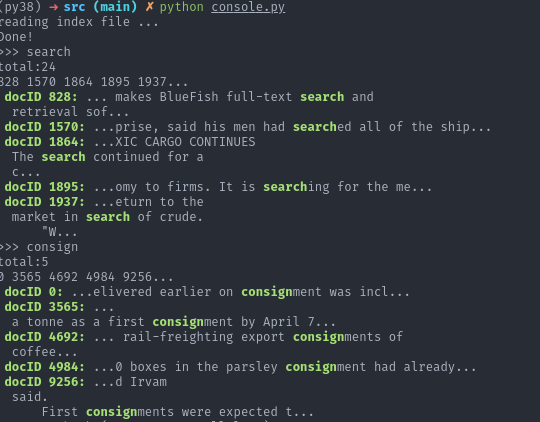

# Web-Search Engine
- language: python

## TODO

- [ ] Define Data Structure
- [ ] wildcard search
- [ ] phrase search
- [ ] add config function which define the data dir and index dir.
- [x] bool search

## Usage

```
git clone ...
cd $WEBHOME/src 
python console.py
```

For example:
input `search`



## Data Structure

### SearchEngine

```python
class SearchEngine:
    def __init__(self) -> None:
        self.state = 0 # 0 for bool, 1 for wildcard search, 2 for phrase search
        self.mode = {
            "bool" : 0,
            "wildcard": 1,
            "phrase": 2,
        }
        self.command = {
            "switch": self.switch
        }
        self.inverted_index = Index.ReadII()
        self.term_dict = None
        self.doc_dict  = None
        self.search_method = [
            bool_search,
            wildcard_search,
            phrase_search
        ]
        pass

```
    
`state` for current search mode, `mode` for all the search modes

| keys           | Description                                                              |
| -------------- | ------------------------------------------------------------------------ |
| state          | current search mode                                                      |
| mode           | all search modes, 0 for bool, 1 for wildcard search, 2 for phrase search |
| command        | supporting commands, `switch`, detail in Table methods                   |
| inverted_index | as name shows                                                            |
| term_dict      | as name shows                                                            |
| doc            | as name shows                                                            |
| search_method  | function list for  search                                                |

| methods     | description                           |
| ----------- | ------------------------------------- |
| search      | search according to current state     |
| switch      | switch current search mode to another |
| interpreter | analysis the string that user inputs  |

### Inverted Index

#### TODO
- [ ] it's too slow to read compressed inverted index, we can use numpy to accelerate.
- [ ] data structure shoudl be modified as bellow. 
- [ ] The class `Index` should load indices when initialized. If there is no such indices, build one. It should be implemented in `__init__`

The format of the inverse index is as follow:

```python
{
	key1:[
        freq,
        {
            docID1 : [pos1,pos2,....],
            docID2 : [pos1,pos2,....],
        },
    ],
    key2:[
        freq,
        {
            docID1 : [pos1,pos2,....],
            docID2 : [pos1,pos2,....],
        },
    ]
}
...
```

For compress, the format is as follow:

```
key_num,key1_len,key1,key2_len,key2,...
freq1,docID1,pos_num,pos1,pos2-pos1,...docID2-docID1,pos_num,pos1,pos2-pos1,...
freq2,docID2,pos_num,pos1,pos2-pos1,...docID2-docID1,pos_num,pos1,pos2-pos1,...
```

All bytes will number and bytes will convert to VB.

Inverse index is stored in ``II.json II.bit`` in ``.\data``(``II.json`` is stored in the format of json and ``II.bit`` is written to file by pickle), and the compressed inversed index is stored in ``II.bin``

**``II.json`` is to large which cannot be upload to github, if you want to use it, ``Index.WriteII(II,mode='json')`` can generate it。**

To construct and use Index, refer to ``src\Index.py``.

### doc dictionary

```python

{
    docID: docName, 
}

```